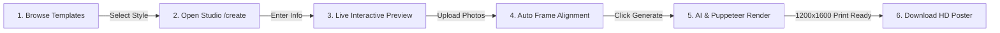

# 🎨 Postera AI — Frontend Web Application

<div align="center">


**Next-Generation Bangladeshi Political, Civic & Occasion Poster Design Studio with Real-Time Interactive Preview.**

</div>

---

## 📖 Overview

**Postera AI Frontend** is a modern, responsive web application built with **Next.js (App Router)** and **Tailwind CSS**. It enables citizens, campaign organizers, party leaders, and event coordinators across Bangladesh to create stunning, print-ready posters in minutes.

Users can browse authentic vector templates, customize their name, designation, party, and slogans in Bengali, upload candidate photos with live position framing, and download print-grade high-resolution posters.

---

## ✨ Key Features

- **🏛️ Authentic Bangladeshi Poster Templates**:
  - Built specifically with authentic cultural and civic motifs (National Monument, Red Sun, Crescent Moon & Minarets, Ballot seals, Mourning ribbons).
  - 100% vector-based SVG templates stored locally in `/public/templates/` (zero dependence on generic third-party stock photos).

- **⚡ Real-Time Interactive Live Preview (`PosterLivePreview`)**:
  - Live 3:4 aspect-ratio poster canvas updates instantly as the user types their name, designation, slogan, and party.
  - Multi-photo arrangement (1 to 3 photos):
    - **Single Photo**: Centered hero candidate portrait with decorative golden borders.
    - **Dual Photos**: Side-by-side balanced frames for joint campaigns or mentor-candidate pairs.
    - **Triple Photos**: Pyramid layout with top central mentor and bottom candidate frames.

- **📑 Multi-Tab Studio Experience (`/create`)**:
  - **মূল টেমপ্লেট (Original Template)**: Inspect the reference vector design and layout guide.
  - **লাইভ ড্রাফট (Live Draft)**: Interactive WYSIWYG draft showing candidate photo inserted directly into the template motif.
  - **জেনারেটেড HD (Generated HD)**: View the finished 1200×1600px server-rendered masterpiece ready for direct download.

- **🤖 AI Slogan Suggestions**:
  - Instant pre-filled Bengali slogans tailored to each occasion (বিজয় দিবস, নির্বাচনী প্রচার, ঈদ মোবারক, শোকবার্তা, ইত্যাদি).

- **📂 My Posters Gallery (`/my-posters`)**:
  - View all previously created posters with quick download (PNG/PDF) and one-click edit/regenerate options.

- **👑 Comprehensive Admin Panel (`/admin`)**:
  - **Dashboard Overview (`/admin`)**: Generation volume, active users, top template metrics.
  - **Template Studio (`/admin/templates`)**: Inspect, toggle status, and create new poster layouts.
  - **Poster Moderation (`/admin/posters`)**: Moderate generated designs, flag inappropriate content.

---

## 📁 Project Structure

```
Frontend/postera-ai/
├── public/
│   └── templates/             # Authentic vector SVG templates
│       ├── victory-day.svg    # মহান বিজয় দিবস (Monument & Red Sun)
│       ├── campaign.svg       # নির্বাচনী প্রচার ও সমাবেশ (Navy & Gold)
│       ├── eid.svg            # পবিত্র ঈদ মোবারক (Crescent & Minaret)
│       ├── condolence.svg     # শোকবার্তা ও বিনম্র শ্রদ্ধা (Candle & Ribbon)
│       ├── greetings.svg      # শুভেচ্ছা ও অভিনন্দন (Laurel & Star)
│       └── conference.svg     # প্রতিনিধি সম্মেলন (Rally Megaphone)
├── src/
│   ├── app/
│   │   ├── layout.tsx         # Global layout with font setup & navigation
│   │   ├── page.tsx           # Landing page with hero, features & showcase
│   │   ├── create/            # Poster creation & live studio editor
│   │   ├── templates/         # Filterable template gallery
│   │   ├── my-posters/        # User's generated posters gallery
│   │   ├── login/             # User login
│   │   ├── register/          # User registration
│   │   └── admin/             # Admin portal (overview, templates, posters)
│   ├── Components/
│   │   ├── Navbar.tsx         # Responsive navigation bar
│   │   ├── Footer.tsx         # Site footer with brand info
│   │   ├── FeaturedTemplates.tsx # Landing page template carousel
│   │   └── poster/
│   │       └── PosterLivePreview.tsx # Real-time SVG/HTML preview canvas
│   └── lib/
│       ├── api.ts             # API client functions with auth headers
│       └── Data.ts            # Fallback template data & type definitions
├── .env                       # Backend API endpoint configurations
├── next.config.ts             # Next.js configuration
├── package.json               # Dependencies & scripts
└── tsconfig.json              # TypeScript configuration
```

---

## 🛠️ Tech Stack & Dependencies

| Category | Technology |
|---|---|
| **Framework** | Next.js 16.3 (App Router) |
| **UI Library** | React 19.2 |
| **Styling** | Tailwind CSS v4 + Vanilla CSS animations |
| **Language** | TypeScript 5 |
| **Icons** | Lucide React + React Icons |
| **Notifications** | React Toastify |
| **Fonts** | Google Fonts (`Hind Siliguri`, `Noto Serif Bengali`, `Geist`) |

---

## ⚙️ Environment Configuration

Create or update the `.env` file in `Frontend/postera-ai/`:

```env
# Authentication Endpoints
NEXT_PUBLIC_API_URL_AUTH_LOGIN=http://localhost:5000/api/auth/login
NEXT_PUBLIC_API_URL_AUTH_REGISTER=http://localhost:5000/api/auth/register
NEXT_PUBLIC_API_URL_USERS_ME=http://localhost:5000/api/auth/me
NEXT_PUBLIC_API_URL_AUTH_LOGOUT=http://localhost:5000/api/auth/logout

# Templates & Poster Endpoints
NEXT_PUBLIC_API_URL_TEMPLATES=http://localhost:5000/api/templates
NEXT_PUBLIC_API_URL_POSTERS=http://localhost:5000/api/posters
NEXT_PUBLIC_API_URL_UPLOAD=http://localhost:5000/api/upload
```

> In production, replace `http://localhost:5000` with your deployed backend server domain.

---

## 🚦 Getting Started

### 1. Install Dependencies
```bash
npm install
```

### 2. Run the Development Server
```bash
npm run dev
```

Open [http://localhost:3000](http://localhost:3000) in your browser to view the application.

### 3. Production Build
Validates all routes and generates the optimized production build:
```bash
npm run build
npm start
```

---

## 🎯 User Journey (How It Works)



1. **টেমপ্লেট নির্বাচন (Select Template)**: User picks from campaign, victory day, eid, condolence, greetings, or conference styles on `/templates`.
2. **তথ্য প্রদান (Enter Details)**: Pre-fills default Bengali slogans, name, designation, party, and district.
3. **ছবি আপলোড (Upload Photos)**: Up to 3 portraits uploaded with instant thumbnail preview and live insertion.
4. **পোস্টার তৈরি (Generate HD)**: Backend processes the design through Google Gemini and Puppeteer, returning an ultra-crisp Cloudinary CDN URL for instant download.

---

## 🛡️ License

MIT License. Developed for **Postera AI (Rise Together)**.
